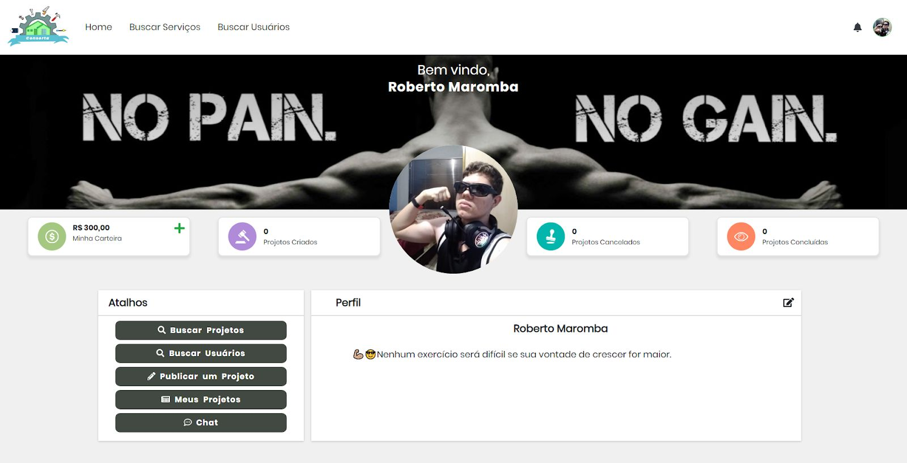
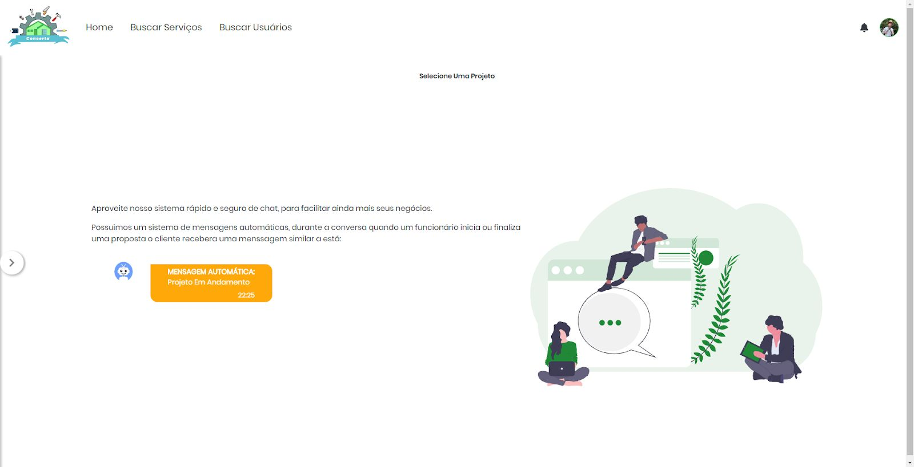
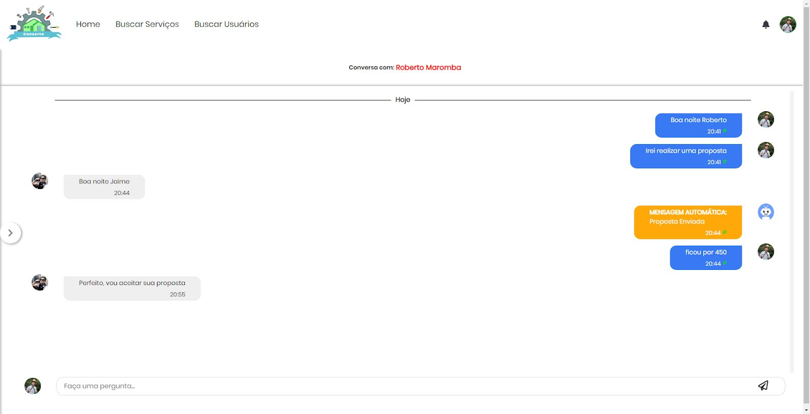
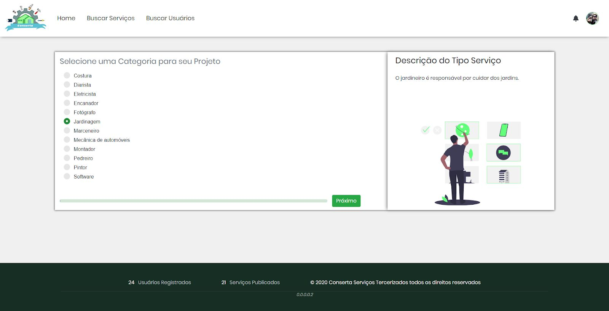
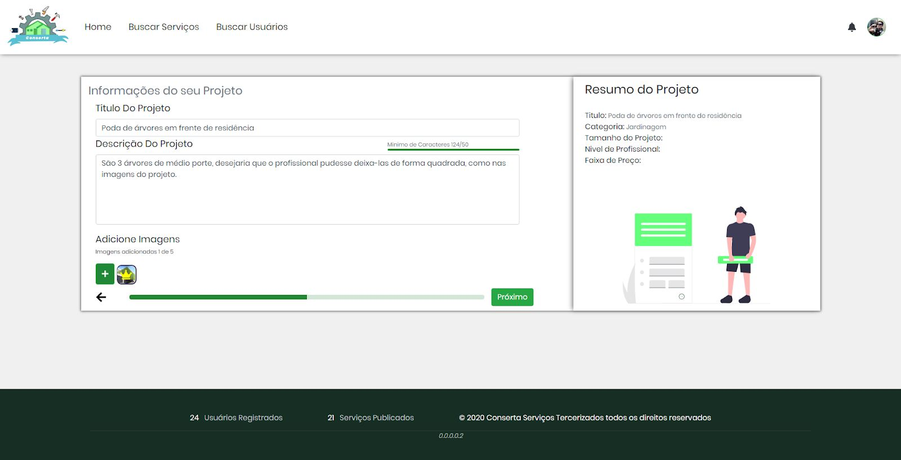
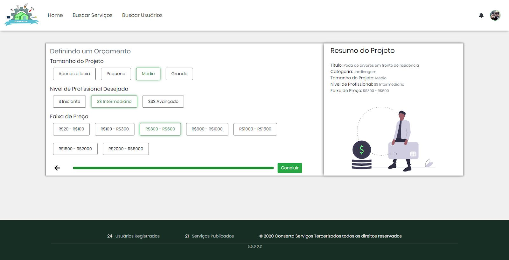
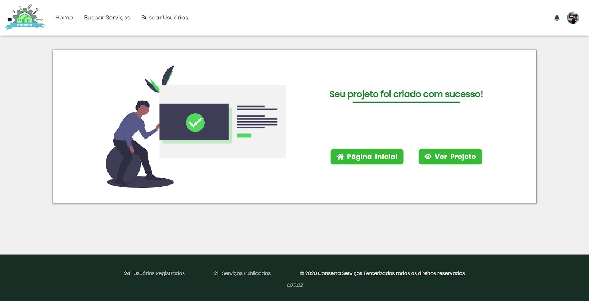
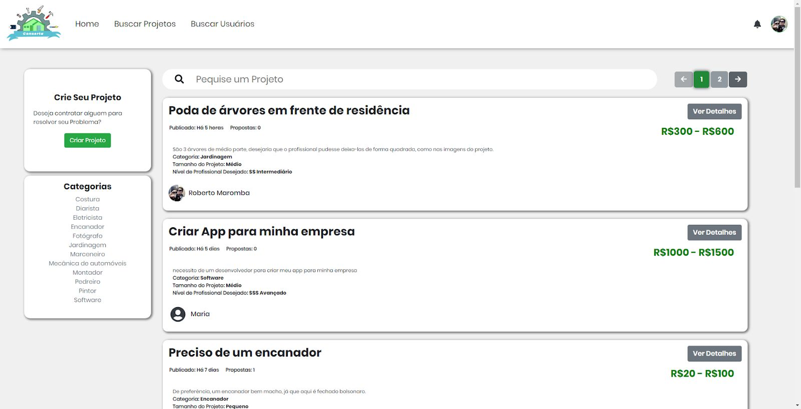
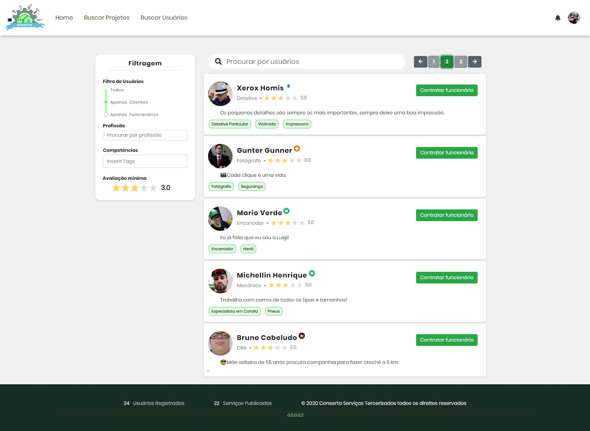
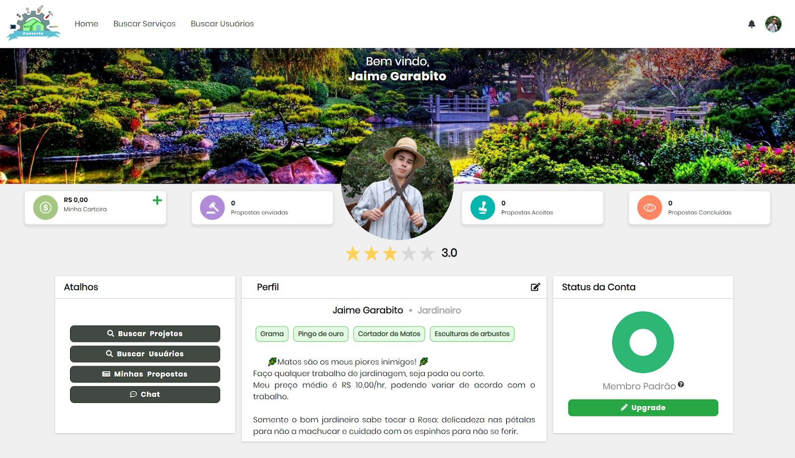

[![Contributors][contributors-shield]][contributors-url]
[![Forks][forks-shield]][forks-url]
[![Stargazers][stars-shield]][stars-url]
[![Issues][issues-shield]][issues-url]
[![MIT License][license-shield]][license-url]
[![LinkedIn][linkedin-shield]][linkedin-url]

 

  <h3 align="center">Projeto de Consclusão de Curso 2020</h3>

  

    Este projeto é uma copia de um repositorio privado, este projeto é um compilado de todos os conhecimentos adquiridos durante o curso tecnico de Informática na instituição Centro Estadual Pedro Boareto Neto.
  
  

## Sobre o Projeto

 
 O Conserta Serviços Terceirizados é uma solução inovadora que permite a
troca de serviços peer-to-peer entre funcionários e clientes cadastrados no sistema
Conserta. As categorias de serviços são pré-selecionadas pelos administradores do
sistema, e incluem tanto serviços tradicionais – como serviços de jardinagem ou de
construção civil – quanto serviços mais modernos – desenvolvimento de software e
manutenção de hardware.

## Algumas das Principais Funcionalidades
 ### Sistema de Mensageria (Chat)
 Um sistema planejado para facilitar as comunicações entre o contratante e o contratado, possui um sistema de mensagem automatica de acordo com as ações realizadas no projeto e proposta
<table>
  <tr>
    <td>Pagina Inicial do Chat</td>
     <td>Chat</td>
    
  </tr>
  <tr>
    <td></td>
    <td></td>
  </tr>
 </table>
 
### Sistema de criação de projeto
Esse sistema permite que o contratante crie seus projetos, para que assim os contratados possam visualizar e realizar uma proposta
<table>
  <tr>
    <td>Primeira Etapa</td>
     <td>Segunda Etapa</td>
    <td>Terceira Etapa</td>
     <td>Projeto criado</td>
    
  </tr>
  <tr>
    <td></td>
    <td></td>
   <td></td>
    <td></td>
  </tr>
 </table>
 
### Sistema de busca de projeto
Permite visualizar os projetos mais recentes e filtrar da maneira desejada.

### Sistema de busca de usuário
Permite visualizar os usuários, para verificar sua avaliação e oferecer um projeto.

### Perfil
Essa tela é dividida em dois tipos, o contratente e o contratado, ela possui a função de tela de perfil e possui alguns atalhos para ações rapidas.
<table>
  <tr>
    <td>Contratante</td>
     <td>Contratado</td>
  </tr>
  <tr>
    <td></td>
    <td></td>
  </tr>
 </table>
 
 
### Conclusão
Esse sistema nos ajudou a consolidar nossos conhecimentos obtidos durante esses 4 anos e nos proporcionou ainda mais aprendizado com novas tecnologias e padrões de projeto.

### Desenvolvedores
 - https://github.com/Nidilap
 - https://github.com/wellhz1n

[contributors-shield]:https://img.shields.io/github/contributors/wellhz1n/Workli?style=for-the-badge
[contributors-url]: https://github.com/wellhz1n/Workli/graphs/contributors
[forks-shield]: https://img.shields.io/github/forks/wellhz1n/Workli?style=for-the-badge
[forks-url]: https://github.com/wellhz1n/Workli/network/members
[stars-shield]: https://img.shields.io/github/stars/wellhz1n/Workli?style=for-the-badge
[stars-url]: https://github.com/wellhz1n/Workli/stargazers
[issues-shield]: https://img.shields.io/github/issues/wellhz1n/Workli?style=for-the-badge
[issues-url]: https://github.com/wellhz1n/Workli/issues
[license-shield]: https://img.shields.io/github/license/wellhz1n/Workli?style=for-the-badge
[license-url]: https://github.com/wellhz1n/Workli/blob/master/LICENSE.txt
[linkedin-shield]: https://img.shields.io/badge/-LinkedIn-black.svg?style=for-the-badge&logo=linkedin&colorB=555
[linkedin-url]: https://linkedin.com/in/wellington-hellstrom-2a31a6174
