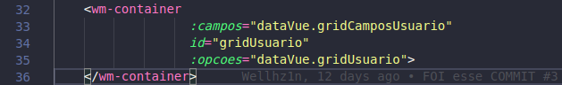
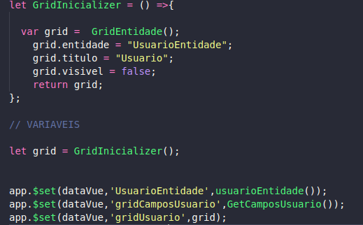
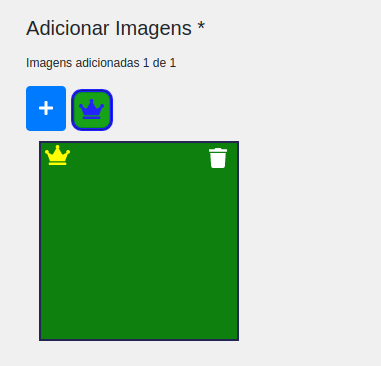
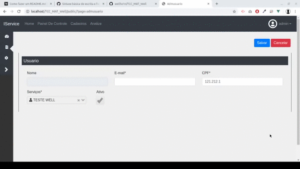

# Documentação Dos Componentes do VUE
    * [Como Declarar](#Como Declarar)


## Como Declarar:
#### wm-container 

#### Este componente é o container que carregara os inputs
### Este componente Possui 3 Propriedades
<ul>
<li><strong>campos</strong>: é uma lista com os campos(inputs)</li>
<li><strong>id</strong>: id do componente</li>
<li><strong>opcoes</strong>: São as opções do grid como visivel e titulo</li>
</ul>

# Declaração no JavaScript
## Instanciando as Opcoes do container

## Instanciando os Campos do container
#### O container No momento possui 5 Tipos
<ul>
<li><strong>input</strong>: Componente de Input tipo <strong>text</strong>.</li>
<li><strong>checkbox</strong>: Componente de  CheckBox </li>
<li><strong>wm-seletor</strong>: Componente de Seletor</li>
<li><strong>cpf</strong>: Componente de input com mascara de cpf</li>
<li><strong>wm-image</strong>: Componente de upload de imagens</li>


</ul>

```
let GetCamposUsuario = ()=>{
    return[
        {
            tipo:'input',
            id:'inputNome',
            titulo:'Nome',
            tamanho:'col-4',
            entidade:grid.entidade,
            visivel:()=>{return true},
            disabled:()=> {return true},
            campo:'nome'
        },
        {
            tipo:'input',
            id:'inputEmail',
            titulo:'E-mail',
            tamanho:'col-4',
            entidade:grid.entidade,
            obrigatorio:true,
            campo:'email'
        },
        {
            tipo:'cpf',
            id:'inputCPF',
            titulo:'CPF',
            tamanho:'col-4',
            entidade:grid.entidade,
            obrigatorio:true,
            campo:'cpf'
        },
        {
            tipo:'wm-seletor',
            id:'Cachumba',
            visivel:()=>{return true},
            titulo:'Serviços',
            disabled:()=>{return false},
            tamanho:'col-3',
            entidade:grid.entidade,
            campo:"nivel",
            limpavel:true,
            icone:true,
            obrigatorio:true,
            ajax:(ss)=>{
                return [{id:'1',nome:'aaaa',icone:"fa-user"}]
            }
        },
        {
            tipo:'checkbox',
            id:'CKAtivo',
            disabled:()=>{return true},
            titulo:'Ativo',
            tamanho:'col-1',
            entidade:grid.entidade,
            campo:'ativo'
        }
    ]
};

```
### Algumas Propriedades Genericas
<ul>
<li><strong>campo</strong>: String com o nome da prop da entidade</li>
<li><strong>entidade</strong>: String com o Nome da entidade </li>
<li><strong>id</strong>: String id do componente</li>
<li><strong>tipo</strong>: String tipo do componente</li>
<li><strong>tamanho</strong>: String tamanho em bootstrap do componente</li>
<li><strong>titulo</strong>: String titulo(label) do componente</li>
<li><strong>disabled</strong>: Function  desativa ou ativa o componente</li>
<li><strong>visivel</strong>: Function  esconde ou mostra o componente</li>
<li><strong>obrigatorio</strong>: Boolean  obriga ou nao o preenchimento do componente</li>
</ul>

### wb-seletor Propriedades
<ul>
<li><strong>icone</strong>: bool permite icones nos itens(font awesome)</li>
<li><strong>limpavel</strong>: bool permite limpar o componente </li>
<li><strong>ajax</strong>: Function retorna um Object com os itens do componente.</li>
</ul>

#### Exemplo De Retorno do Ajax

# Com Icone
```
  ajax:(componente)=>{
                return [{id:'1',nome:'aaaa',icone:"fa-user"}]
            }
```

# Sem Icone

```
  ajax:(componente)=>{
                return [{id:'1',nome:'aaaa'}]
            }
```

# Componente wm-image


### propriedades especificas
<ul>
<li><strong>limite</strong>: INT recebe o numero limite de imagens, por padrao é 5</li>
</ul>

### Exemplo de Declaração

```
 {
          tipo:'wm-imagem',
          id:'img',
          titulo:'Adicionar Imagens',
          tamanho:'col-sm-8 col-md-4',
          limite:1,
          obrigatorio:true,
          entidade:Grid.entidade,
          visivel:()=>{return true},
          disabled:()=> {
              return false},
          campo:'lista'
      }

```

### Forma do Objeto da Lista de Imagens
```
{
    img:"IMAGEM EM BASE64(APOS A VIRGULA DO data:image/jpeg;base64,)",
    principal:"Valor BOOLEAN, obrigatorio define se a imagen é a principal"
}
```
### Forma do Objeto de Retorno
```
{
    img:'Imagem em Base64',
    principal:'Boolean se a imagem é a principal',
    selecionado:'Boolean se a imagem é a selecionada no momento',
    indice:'int indice da imagem selecionada na lista'
}

```
# Gif Demonstrando Resultado Final


# Componente de Loading
```
    <wm-loading msg="Carregando..." cor="green"></wm-loading>

```
### Valor Padrão das Propriedades
- _msg_ : Carregando...
- _cor_ : #28a745 (um verde bonito)

> imagem
;

### Gerar APk ANDROID
```

First:

react-native bundle --platform android --dev false --entry-file index.js --bundle-output android/app/src/main/assets/index.android.bundle --assets-dest android/app/src/main/res
finally build:

./gradlew assembleRelease -x bundleReleaseJsAndAssets
```
